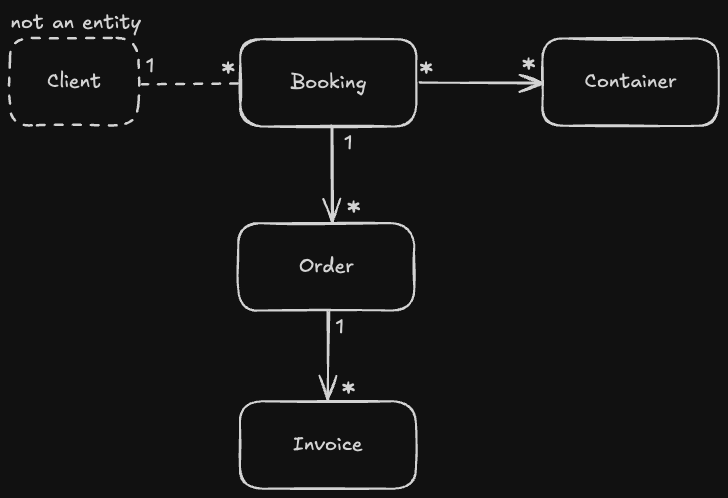

# Nauta Test App

> **Note:** This project was created to fulfill the requirements of the challenge described in [challenge.pdf](./challenge.pdf).

## What is this project?
This is a backend service built with Kotlin and Spring Boot. It manages business operations related to bookings, orders, containers, and invoices. The project is designed as a technical interview and architecture test example, featuring REST endpoints, validation, documentation, metrics, and health checks.

## How to run the project

### Using IntelliJ IDEA
1. Import the project as a Gradle Project.
2. Run the `InterviewExampleApplication.kt` main class from the IDE.

### Using Gradle from the console
```sh
./gradlew bootRun
```

### Using Docker Compose
```sh
docker-compose up --build
```
This will build and start the service at `http://localhost:8080`.

## How to run the tests

### From IntelliJ IDEA
- Right-click the `src/test/kotlin` directory or any test class and select `Run`.

### From the console with Gradle
```sh
./gradlew test
```

### Using Docker (test stage)
```sh
docker build --target test .
```
This will run the tests inside the container and show the results in the console.

## Chosen technologies
- **Spring Boot Web**: Main framework for exposing REST APIs.
- **Exposed**: Lightweight ORM for Kotlin, used to interact with the H2 database.
- **H2 Database**: In-memory database for development and testing. [H2 Console](http://localhost:8080/h2-console)
- **Jakarta Validation**: Input validation for DTOs and requests.
- **Swagger (OpenAPI)**: Automatic API documentation via springdoc-openapi. [Swagger UI](http://localhost:8080/swagger-ui.html)
- **Spring Boot Actuator**: Health and metrics endpoints for monitoring.
- **RestControllerAdvice**: Centralized exception and error handling for responses.

## Project model diagram

The following diagram shows how the main business entities are modeled in this service:



## Idempotent ID generation
Business entities generate their IDs idempotently using backend-generated UUIDs. This ensures that, in case of retries or duplicates, no repeated entities are created and data integrity is maintained.

## API usage examples

You can find ready-to-use example requests for local testing in the [api-examples.sh](./api-examples.sh) script. This script contains curl commands to create and query bookings, containers, and orders using the API endpoints. Just run it after starting the service to quickly populate and test the API.

## Project architecture
The project follows a modular and clean architecture:
- **Controller**: Exposes REST endpoints and receives requests.
- **Core/Action/Model**: Contains business logic and domain models.
- **Infrastructure/Repository**: Implements data access using Exposed and H2.
- **Config**: Beans, security, validation, and middleware configuration.
- **Advice**: Global exception handling.

This separation makes the codebase easy to test, maintain, and scale.

---

For questions or improvements, feel free to open an issue or pull request!
